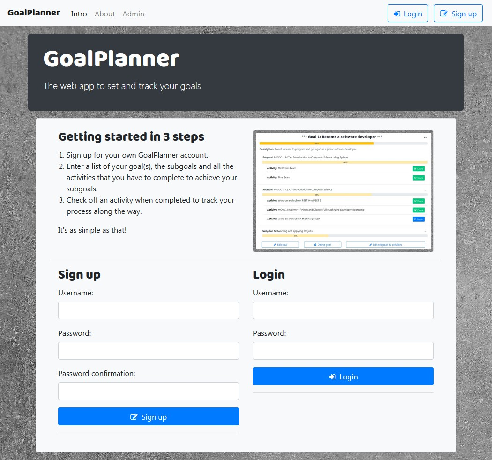
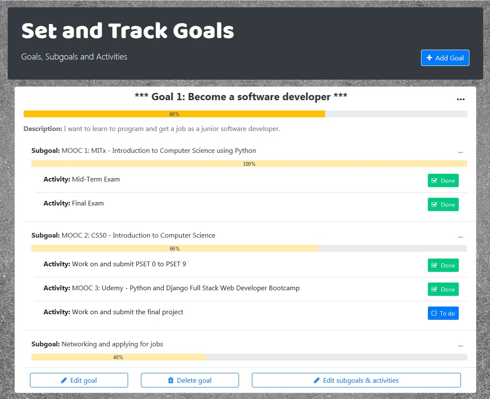
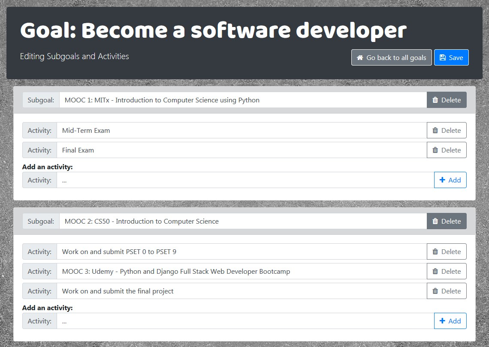

# GoalPlanner Web App
This is the first app that I've developed and it's of my own devising with the goal to learn programming. Please bear this in mind if you plan to use this code! My goal to learn programming is also related to the function of the app;
* sign up for your own GoalPlanner account
* setting goals, subgoals and activities
* check off the activities
* track the progress of the subgoals and the overall progress of the main goal(s)

[You can find the deployed version on goalplannerapp.herokuapp.com](https://goalplannerapp.herokuapp.com/)

With this app I'm also going to finish Harvard's [CS50](https://cs50.harvard.edu/) course, as this is my final project.

## Build with
Miniconda, Atom, Python, Django, SQLite3, HTML, CSS, Sass, Bootstrap, JavaScript and AJAX

## Personal main first time challenges
* Inline formsets
* Integrating Sass and AJAX
* Django forms with Bootstrap styling
* Two Django forms on one page
* CSP headers
* Deployment

## Main resources and acknowledgements
* [CS50 - Introduction to Computer Science (through edX)](https://cs50.harvard.edu/)
* [edX - Free Online Courses by Harvard, MIT, & more](https://www.edx.org/)
* [Udemy - Python and Django Full Stack Web Developer Bootcamp](https://www.udemy.com/course/python-and-django-full-stack-web-developer-bootcamp/)
* [Mozilla - MDN web docs - Django Web Framework (Python)](https://developer.mozilla.org/en-US/docs/Learn/Server-side/Django)
* [Django documentation](https://docs.djangoproject.com/en/2.2/)
* [Bootstrap documentation](https://getbootstrap.com/)
* [reddit - Multiple Models in a single Template](https://www.reddit.com/r/django/comments/2qlv8v/is_there_a_view_that_handles_multiple_models_in_a/)
* [GitHub - Django nested inline formsets example](https://github.com/philgyford/django-nested-inline-formsets-example)
* [Stack Overflow - Toggle Checkbox in Django and Write to Database](https://stackoverflow.com/questions/32826636/toggle-checkbox-in-django-and-write-to-database/32830026)
* [Stack Overflow - How correctly show ValidationError in Django and AJAX?](https://stackoverflow.com/questions/47076009/how-correctly-show-validationerror-in-django-and-ajax)
* [Vitor Freitas - How to Use Bootstrap 4 Forms With Django](https://simpleisbetterthancomplex.com/tutorial/2018/08/13/how-to-use-bootstrap-4-forms-with-django.html)
* [Vitor Freitas - How to Render Django Form Manually](https://simpleisbetterthancomplex.com/article/2017/08/19/how-to-render-django-form-manually.html)
* [Vitor Freitas - How to Implement CRUD Using Ajax and Json](https://simpleisbetterthancomplex.com/tutorial/2016/11/15/how-to-implement-a-crud-using-ajax-and-json.html)
* [Vitor Freitas - How to Use Django's Built-in Login System](https://simpleisbetterthancomplex.com/tutorial/2016/06/27/how-to-use-djangos-built-in-login-system.html)
* [Data Flair - AJAX in Django](https://data-flair.training/blogs/ajax-in-django/)
* [Medium - Keep that damn footer at the bottom](https://medium.com/@zerox/keep-that-damn-footer-at-the-bottom-c7a921cb9551)
* [Medium - Implementing Content Security Policy(CSP) in Django Site](https://medium.com/@brixlabs/implementing-content-security-policy-csp-in-django-site-a1df8f1c4f5d)
* [Andrea Robertson - Django example: Setting up HTTP security](https://andrearobertson.com/2018/05/19/django-example-setting-up-http-security/)
* [AccordBox - How to use SCSS/SASS in your Django project (Python Way)](https://www.accordbox.com/blog/how-use-scss-sass-your-django-project-python-way/)
* [Mugo Web - How to customize Bootstrap 4 using Sass](https://www.mugo.ca/Blog/How-to-customize-Bootstrap-4-using-Sass)
* [Martijn Cuppens - Responsive Font Sizes (RFS) in Bootstrap](https://css-tricks.com/using-a-mixin-to-take-the-math-out-of-responsive-font-sizes/)
* [Sitepoint - Adding/Removing classes on resize JQuery](https://www.sitepoint.com/community/t/adding-removing-classes-on-resize-jquery/191805)
* ...and Google of course :)

## Screenshots
Homepage:

Goals page:

Edit subgoals and activities page:

